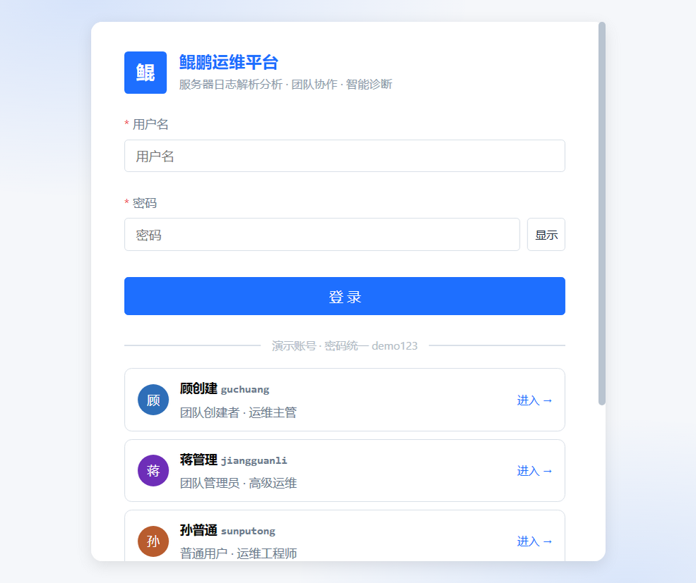
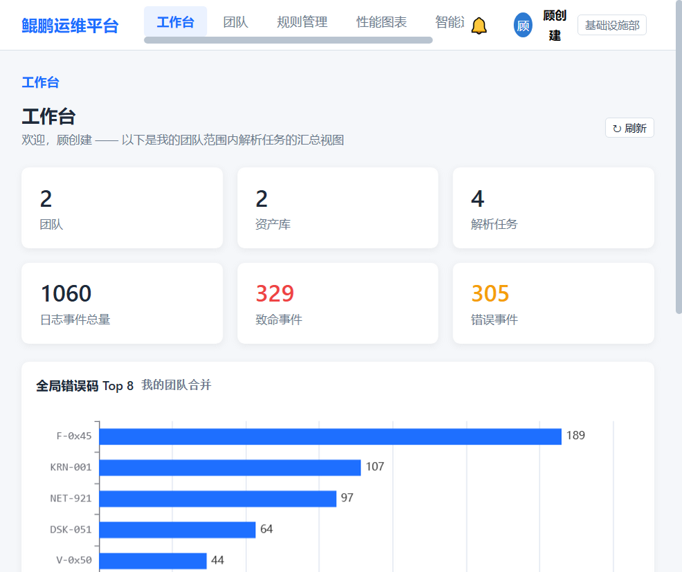
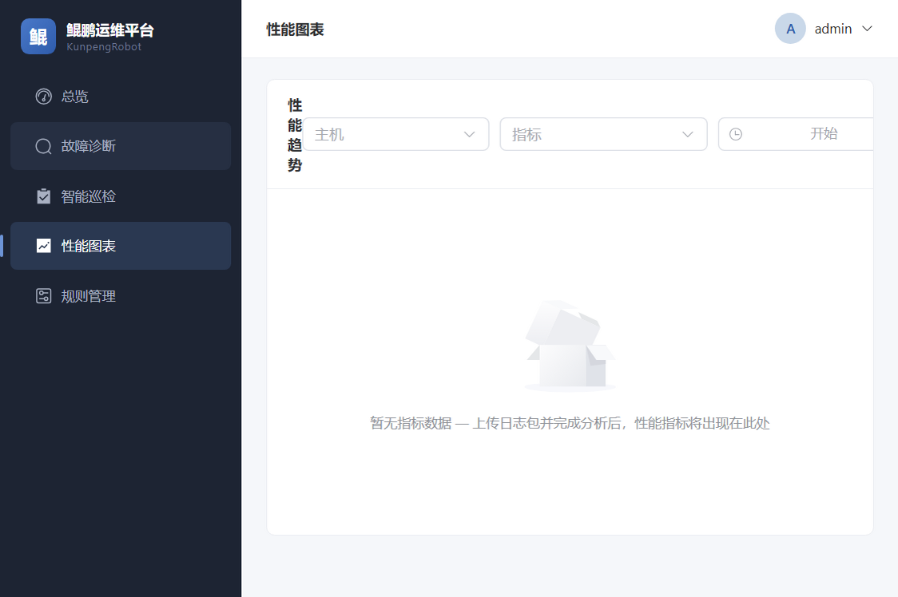
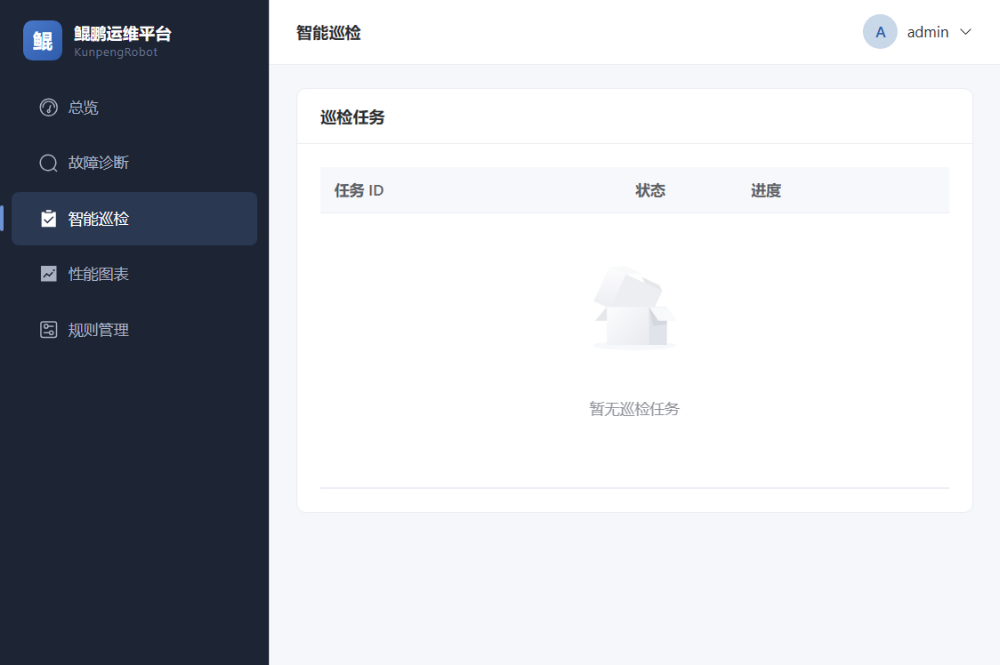
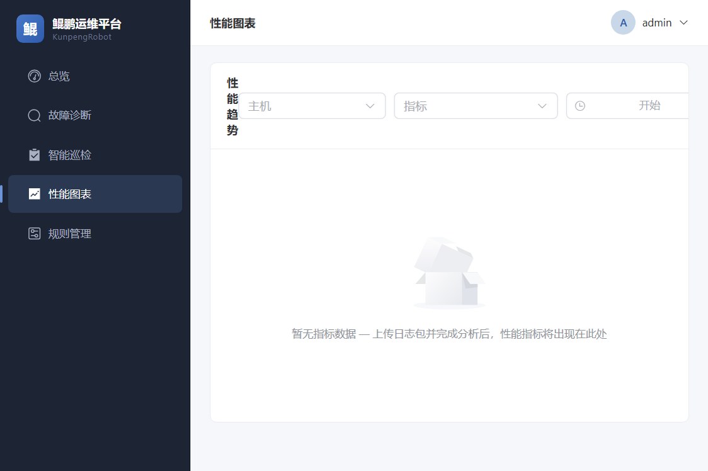
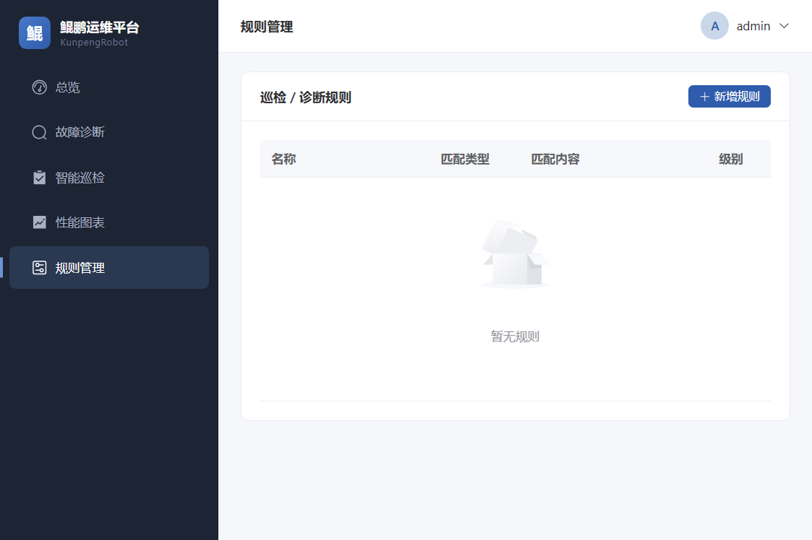

# KunpengRobot · 鲲鹏运维平台

基于 Python 的轻量级智能运维平台，支持部署到 **ARM（鲲鹏）/ x86** 架构的 **Linux 与 Windows** 环境，提供 Web 端访问。

> v0.2：认证 / 团队协作 / 日志解析 / 规则引擎 / 按需 LLM 总结 / 性能图表 / 审计 全链路已实现。前端基于开源项目 [witty-log-analyzer](https://atomgit.com/StackTony/witty-log-analyzer)（MulanPSL-2.0）的 o-design 实现整体替换重构。

## 功能特性

- **用户权限控制**：JWT + RBAC，平台管理员 / 普通用户 + 团队级三角色（创建者 / 管理员 / 普通用户），令牌刷新与黑名单登出
- **团队协作**：团队创建 / 申请加入 / 邀请审批 / 成员角色调整，资产库（按团队隔离）管理
- **日志解析**：6 种解析器插件（Linux syslog / Nginx / Windows 事件 / Redfish / Java 应用 / 通用兜底），上传前 512KB 预检，文件上传与粘贴文本两种模式
- **故障诊断**：被动上传日志包，Redis Stream 队列并发分析（100+ QPS），SSE 实时流式输出，原始日志服务端分页筛选
- **智能巡检**：规则引擎优先匹配 + 按需 LLM 智能总结（SSE 流式生成，未配置 LLM 自动降级纯规则）
- **规则管理**：管理员对巡检规则增删改查（关键字 / 正则 / 阈值三类），正则灾难性回溯防护、版本化热加载、变更审计
- **性能图表**：ECharts 时序图表，服务端降采样查询，视图配置服务端持久化（刷新 / 切页签 / 换设备不丢失）
- **审计日志**：团队级操作审计（任务 / 资产 / 成员 / 规则变更），支持按动作与关键字检索

## 界面预览

> 以下为 v0.1 旧版（Element Plus）界面截图，v0.2 已切换为 o-design 风格新前端，新版截图待补充。

| 登录 | 总览 |
|------|------|
|  |  |

| 故障诊断 | 智能巡检 |
|----------|----------|
|  |  |

| 性能图表 | 规则管理 |
|----------|----------|
|  |  |

## 技术栈

| 层 | 技术 |
|----|------|
| 后端 | Python 3.11+ · FastAPI · SQLAlchemy(async) · APScheduler |
| 中间件 | PostgreSQL（元数据 + 时间分区指标）· Redis（任务队列 / 事件总线 / 限流） |
| 前端 | Vue 3 · TypeScript · Pinia · Vue Router · ECharts · Vite 6（o-design 风格，无重型组件库） |
| LLM | OpenAI 兼容 API（可选，未配置时自动降级为纯规则分析） |

## 快速开始

### 1. 环境准备

- Python 3.11+、Node.js 18+
- PostgreSQL 15+、Redis 7+（本机或容器均可）

### 2. 后端

```bash
cd backend

# 安装依赖（建议先创建虚拟环境）
pip install -r requirements.txt

# 配置环境
copy .env.example .env      # Windows
# cp .env.example .env      # Linux，并修改数据库/Redis/LLM 连接信息

# 启动 API 服务（首次启动自动建表并初始化 admin 账号）
uvicorn app.main:app --reload --port 8000

# 另开终端，启动分析 Worker
python -m app.worker
```

默认管理员账号：`admin / admin123`（首次登录后请修改）。

演示账号（密码统一 `demo123`，`SEED_DEMO_DATA=True` 时自动初始化，生产环境请关闭）：

| 账号 | 姓名 | 平台角色 | 团队角色（演示团队） |
|------|------|----------|----------------------|
| guchuang | 顾创建 | 管理员 | 北京A · 创建者 |
| jiangguanli | 蒋管理 | 普通用户 | 北京A · 管理员；上海B · 创建者 |
| sunputong | 孙普通 | 普通用户 | 北京A · 普通成员（有一条待处理邀请） |
| zhangshenpi | 张审批 | 普通用户 | 上海B · 管理员（有一条待审批申请） |
| liyiban | 李一般 | 普通用户 | 无团队（可体验申请加入流程） |

登录页提供演示账号一键填充，便于快速体验不同角色视角下的权限差异。

API 文档：http://localhost:8000/docs

### 3. 前端

```bash
cd frontend
npm install
npm run dev          # 开发模式，http://localhost:5173
npm run build        # 生产构建，产物在 dist/
```

开发模式下接口请求由 Vite 代理至 `http://localhost:8000`。

### 4. Docker Compose 一键部署

```bash
cd deploy/docker
docker compose up -d       # 拉起 postgres / redis / api / worker / web
```

双架构镜像支持：`docker buildx build --platform linux/amd64,linux/arm64 ...`

### 5. 裸机部署

- **Linux（systemd）**：`deploy/linux/install.sh`
- **Windows（NSSM 服务）**：`deploy/windows/install-nssm.ps1`
- **Nginx 反代**：`deploy/nginx/nginx.conf`（含 SSE 专用配置 `proxy_buffering off`）

## 项目结构

```
KunpengRobot/
├── backend/
│   └── app/
│       ├── api/            # 认证 / 任务上传 / SSE / 规则 / 指标
│       ├── core/           # 配置 / 安全 / 数据库 / 依赖注入
│       ├── models/         # 用户-角色-权限 / 任务 / 规则 / 指标
│       ├── queue/          # Redis Stream 任务队列
│       ├── events/         # 事件总线（Pub/Sub + Stream 留存）
│       ├── modules/        # 诊断流水线 / 巡检 / 解析器与检查项插件
│       ├── worker/         # Worker 消费循环 + 定时调度
│       └── metrics/        # 指标分区管理
├── frontend/               # Vue3 + TS + Pinia（o-design 风格，基于 witty-log-analyzer）
├── deploy/                 # docker-compose / Nginx / 裸机脚本
└── docs/                   # 框架设计文档 / 界面截图
```

## 后续规划

- [ ] 具体服务器类型的日志解析器插件（Drain3 模板化解析）
- [ ] 巡检模板与定时巡检任务管理界面
- [ ] 用户管理界面（目前仅种子数据 admin）
- [ ] Alembic 数据库迁移（目前为 create_all）
- [ ] 诊断报告证据链（findings 关联原始日志行号）

详细架构设计见 [docs/框架设计.md](docs/框架设计.md)。

## License

- 后端及整体项目：MIT
- 前端（`frontend/`）：基于 [witty-log-analyzer](https://atomgit.com/StackTony/witty-log-analyzer) 修改，遵循 [MulanPSL-2.0](frontend/LICENSE-witty)
